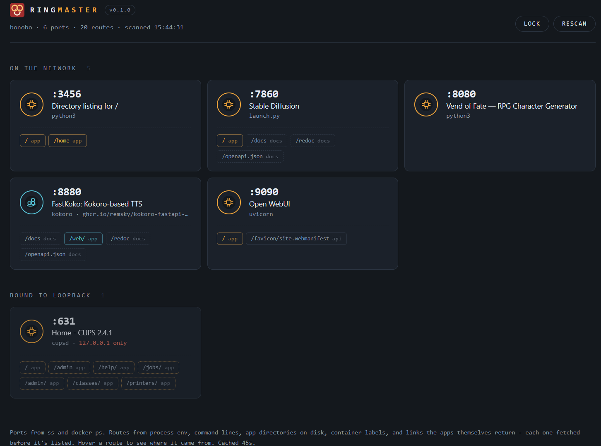

# ringmaster

A dashboard for your home server that answers one question: *What am I running,
and on which port?*

If you're like me, you've installed a dozen open-source projects on your box and
can never remember which port each one landed on.

It sits on `:80`, sweeps the box every time you load it, and lists every web app
it can find — bare metal and Docker alike — with working links. Nothing to
register, no config file to keep in sync. Start a new service and it shows up on
the next refresh.

One Python file, standard library only. No pip, no node, no database.



---

## What it finds

**Ports** come from two places:

| Source | What it gives |
| --- | --- |
| `ss -tlnp` | every listening TCP port, plus the process and pids holding it |
| `docker ps` | running containers and their published host ports |

Ports published by Docker are matched back to their container, so you get
`jellyfin` rather than `docker-proxy`. `ss` reports a *thread* name, which some
runtimes rewrite — PyTorch calls its main thread `pt_main_thread` — so when the
name looks like a thread or a bare interpreter, ringmaster names the app from
the executable, the script it's running, or the checkout directory instead.

Everything found is then actually fetched over HTTP (falling back to a TLS
handshake), so databases, SSH and message brokers drop out on their own — only
things that really answer a browser survive.

**Routes** are the interesting part. Plenty of services answer `/` with JSON and
keep the actual UI somewhere else, so ringmaster hunts for the rest of the app:

| Source | Example of what it catches |
| --- | --- |
| The app's own response at `/` | links in HTML, url fields in JSON, `Link:` headers, redirects |
| `/proc/<pid>/environ` | `BASE_URL`, `ROOT_PATH`, `SCRIPT_NAME`, `PUBLIC_URL`, `CONTEXT_PATH`, `*_BASE_URL` |
| `/proc/<pid>/cmdline` | `--root-path /ui`, `--base-url=/app` |
| `/proc/<pid>/cwd` | `static/ public/ dist/ ui/ admin/ www/` sitting in the app root |
| `docker inspect` | container env, Traefik ``PathPrefix(`/x`)`` labels, bind-mount sources |
| A list of conventions | `/ui`, `/admin`, `/dashboard`, `/swagger`, `/docs`, `/redoc`, … |

Every candidate is fetched before it's listed — a hint alone never puts a link on
the page. What comes back decides how it's labelled:

- **app** — HTML with a `<title>`, or an `og:title` / `twitter:title` for apps
  like Gradio that set the real title from JavaScript
- **api** — JSON or XML
- **docs** — swagger-ui, redoc, rapidoc, graphiql or an OpenAPI document

Byte-identical responses collapse to the shortest path, so `/ui`, `/ui/` and
`/app` pointing at one SPA appear once. The card headline links to the best UI
route rather than `/`, and hovering any route pill tells you where that path came
from (`BASE_URL in the process environment`, `url in the API response at /`).

A typical card, for a service whose root is a REST API:

```
:8300   Widget Control
        widgetd · docker · ghcr.io/you/widgetd
        [ / api ] [ /ui/ app ] [ /console/ app ] [ /docs docs ]
```

Services bound only to `127.0.0.1` get their own section, shown but not linked —
they're usually behind a reverse proxy, and a link to them from your laptop
wouldn't work.

---

## Layout

```text
ringmaster.py                     the whole app - stdlib only, nothing imported from here
scripts/install.sh                copies it to /usr/local/bin, writes the unit, starts it
scripts/uninstall.sh              stop, disable, remove
systemd/ringmaster.service        the unit template; install.sh rewrites ExecStart and the port
assets/ringmaster-favicon.svg     the site icon, also embedded in ringmaster.py
```

Only `ringmaster.py` is installed, so the icon lives in the script as well as in
`assets/` — edit the two together.

---

## Requirements

- **Linux** — ports come from `ss`, route hints from `/proc`
- **Python 3.8+** — standard library only, nothing to install
- **`iproute2`** for `ss` — without it, only Docker containers are found
- **systemd** if you want it running as a service; `install.sh` works without
  it, and tells you how to start it yourself
- **Docker** only if you want container discovery

---

## Install

```bash
sudo ./scripts/install.sh
```

That copies `ringmaster.py` to `/usr/local/bin`, installs a systemd unit, enables
it, and prints the URL. Options:

```bash
sudo ./scripts/install.sh --no-start         # install without enabling the service
sudo ./scripts/install.sh --port 8080        # somewhere other than :80
sudo ./scripts/install.sh --ask-password     # prompt for optional password, then store in /etc/ringmaster.pw
sudo ./scripts/install.sh --password 'pw'    # non-interactive
```

Re-running install.sh upgrades in place and keeps an existing password file.

It runs as root because it needs `:80`, process names from `ss -tlnp`, and
`/proc` for the route hints. It only ever reads — nothing on the box is modified.

---

## Password (optional)

Leave it unset and the dashboard is open to anyone who can reach the port. Set
one and every page asks first:

```bash
printf 'your-password\n' | sudo tee /etc/ringmaster.pw >/dev/null
sudo chmod 600 /etc/ringmaster.pw
# then in the unit: Environment=RINGMASTER_PASSWORD_FILE=/etc/ringmaster.pw
sudo systemctl restart ringmaster
```

or just `sudo ./scripts/install.sh --ask-password`.

A correct password sets an `HttpOnly`, `SameSite=Lax` session cookie good for 12
hours; a **Lock** button next to Rescan ends the session. Comparison is
constant-time, five bad guesses from one address earn a 60-second lockout, and
`/apps.json` also accepts HTTP Basic so scripts work: `curl -u :your-password`.

Prefer `RINGMASTER_PASSWORD_FILE` over `RINGMASTER_PASSWORD` — anything in the
unit's environment is readable by any local user via `systemctl show`.

**Be clear-eyed about what this is.** Over plain HTTP the password crosses the
network in the clear and the cookie can't be marked `Secure`. It's a lock on the
LAN door, not real security. Don't expose ringmaster to the internet; if you
need to, put it behind a TLS-terminating proxy and let that do the auth.

---

## Configuration

All via environment (set them in the unit file):

| Variable | Default | Meaning |
| --- | --- | --- |
| `RINGMASTER_PORT` | `80` | Port to serve the dashboard on |
| `RINGMASTER_TTL` | `45` | Seconds a scan is cached before a page load re-scans |
| `RINGMASTER_TIMEOUT` | `1.2` | Per-probe socket timeout, seconds |
| `RINGMASTER_MAX_PATHS` | `26` | Cap on paths probed per port |
| `RINGMASTER_DEEP` | `1` | `0` disables route discovery (root only, much faster) |
| `RINGMASTER_PASSWORD` | — | Password, inline |
| `RINGMASTER_PASSWORD_FILE` | — | Password, read from a file (preferred) |
| `RINGMASTER_SESSION_HOURS` | `12` | Session cookie lifetime |

Endpoints: `/` the dashboard, `/?rescan=1` force a fresh sweep, `/apps.json` the
whole scan as JSON, `/logout` drop the session, `/healthz` an unauthenticated
liveness check, `/favicon.svg` the site icon (also unauthenticated, so the login
page shows it).

Three lists near the top of the script are worth editing as you learn your own
box: `SKIP_PORTS` (never probed), `COMMON_PATHS` (conventional UI paths tried on
everything), and `UI_DIRS` (directory names that suggest a served path).

---

## Troubleshooting

**Nothing listed, or only Docker things.** `ss -tlnp` needs root to show process
names — check the service is running as root, and that `iproute2` is installed.

**An app is missing.** It may not answer `/` at all. Try
`curl -sI localhost:PORT/` by hand; if that's a 404, add its real path to
`COMMON_PATHS`. Also check the port isn't in `SKIP_PORTS`.

**Scans feel slow.** Deep discovery probes up to 26 paths per port. Lower
`RINGMASTER_MAX_PATHS`, raise `RINGMASTER_TTL`, or set `RINGMASTER_DEEP=0`.

**Service won't start.** `journalctl -u ringmaster -n 50`. The usual cause is
something else already on `:80` — `ss -tlnp | grep :80`.

**A link 404s.** The path was real when probed but needs a trailing slash or a
session. Hover the pill to see where the path came from; that usually explains it.

---

## Uninstall

```bash
sudo ./scripts/uninstall.sh           # stop, disable, remove script and unit
sudo ./scripts/uninstall.sh --purge   # also delete /etc/ringmaster.pw
```

---

## Known limits

- **Reverse-proxy configs aren't parsed.** An nginx `location /jelly/` mapped to
  a loopback port would give you the *proxy's* URL, not the app's own port, so
  those paths are deliberately left out rather than shown as broken links.
- **Container filesystems aren't inspected**, only bind-mount sources visible on
  the host. Env and labels from `docker inspect` fill most of that gap.
- **Apps living under `/home` give up their working directory.** The unit sets
  `ProtectHome=true`, so systemd hides `/home` from ringmaster itself: the
  `/proc/<pid>/cwd` hints above find nothing there, and an app that would have
  been named after its checkout falls back to its script — `launch.py` rather
  than `stable-diffusion-webui`. Env, cmdline and response hints are unaffected.
  Set `ProtectHome=read-only` in the unit if you'd rather have the hints than
  the sandbox.
- **HTTP only** for the dashboard itself; discovered apps may be either.
- Probing is polite but real: each scan sends a `GET /` to every listening port.
  Anything that logs requests will show ringmaster in its access log.

---

## License

MIT — see [LICENSE.md](LICENSE.md).
